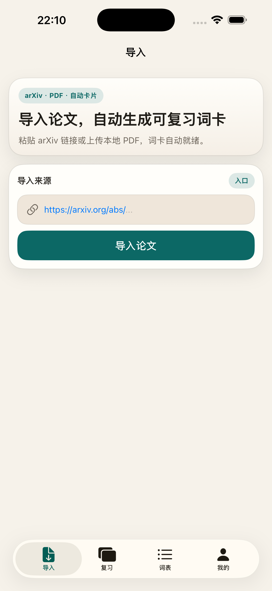
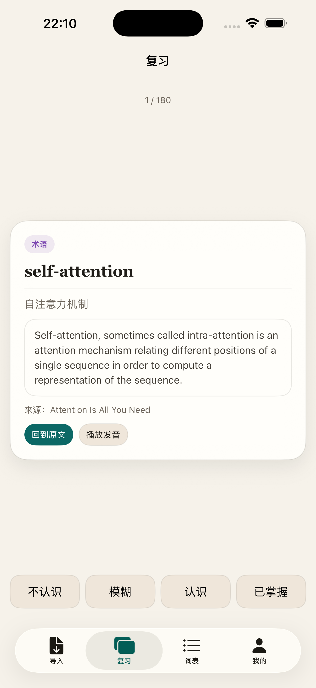
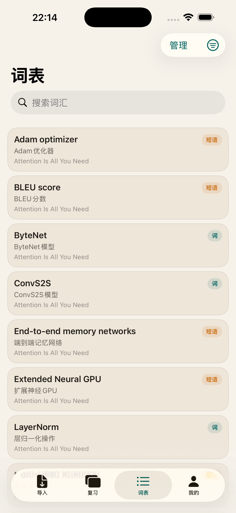
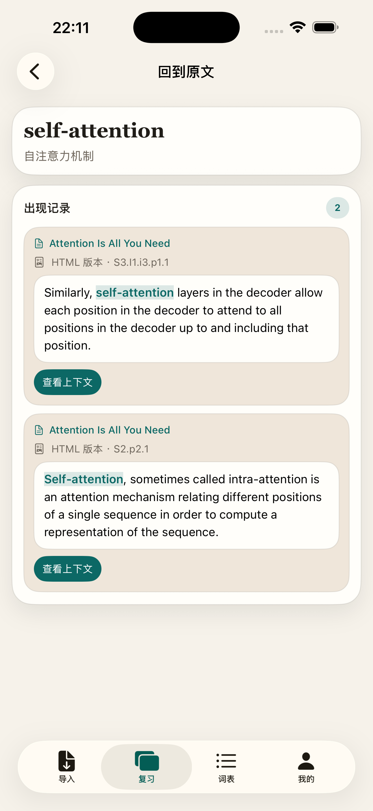

<div align="center">

  # PaperLoop

  **将学术论文自动转化为可持续复习的词汇闪卡**

  iOS &nbsp;|&nbsp; SwiftUI · SwiftData

  [](https://developer.apple.com/swift/)
  [](https://swift.org)

</div>

---

## 截图

<div align="center">

| 导入论文 | 今日复习 | 词表 | 原文回链 |
|:---:|:---:|:---:|:---:|
|  |  |  |  |

</div>

---

## 功能亮点

- **论文导入** — 输入 arXiv 链接一键抓取（HTML 优先，PDF 兜底），或导入本地 PDF
- **LLM 卡片生成** — 批量提取词汇、术语和地道句型，自动去重过滤低质结果
- **间隔复习** — 基于 SM-2 算法生成每日复习队列，四档评分驱动下次复习时间
- **原文回链** — 每张卡片精确关联原文句子，支持在论文上下文中查看出处
- **发音支持** — 集成 Doubao TTS / DashScope TTS 朗读单词与例句
- **API Key 管理** — 兼容 OpenAI 接口，Key 安全存储于系统 Keychain

---

## 架构概览

```
paper_loopApp (@main)
  └─ ContentView (TabView · 5 tabs)
       ├─ ImportView          论文导入 + 进度追踪
       ├─ ReviewView          今日复习队列（SM-2）
       ├─ VocabView           全量词表 + 搜索过滤
       ├─ SourceDetailView    原文回链 · HTML/PDF 阅读器
       └─ ProfileView         设置 · API Key · TTS

数据模型（SwiftData）：
  Paper ──── Occurrence ──── Card   (多对多)
                               └─── ReviewLog

服务层：
  ImportService       arXiv 抓取 → LLM 提取 全流程编排
  CardPipeline        批量 LLM 卡片提取（batch 30）
  LLMService          OpenAI 兼容 API 调用
  ArXivFetchService   HTML 优先抓取 + PDF 兜底
  DoubaoTTSService    发音合成
  ReviewScheduler     SM-2 复习调度
```

---

## 界面风格

暖米色背景 + 深青绿主色，原型参考 `docs/paper_vocab_iphone_mvp_v2.html`：

```
暖米色背景   #f6f2ea  (Theme.bg)
暖白卡片     #fffdfa  (Theme.surface)
深青绿主色   #0c6865  (Theme.primary)
主文本       #201d18  (Theme.textPrimary)
次要文本     #6f675d  (Theme.textMuted)

圆角：卡片 r24 · 列表行 r18 · 按钮/输入框 r16
字体：词语/标题 Georgia · 正文系统无衬线
```

所有 token 统一在 `paper-loop/paper-loop/Theme.swift`，**禁止硬编码颜色和圆角**。

---

## 构建运行

```bash
# 克隆仓库
git clone <repo-url>
cd paper-loop

# 用 Xcode 打开
open paper-loop/paper-loop.xcodeproj
```

选择目标设备后直接 Build & Run 即可。

**Python 脚本**（后端 / 数据处理）：
```bash
uv run --env-file .env <script>
just backend          # 启动后端开发服务器
just backend-install  # 安装后端依赖
```

---

## 目录结构

```
paper-loop/paper-loop/   iOS App 源码（SwiftUI + SwiftData）
  Models/                数据模型
  Services/              业务服务层
  Views/                 各页面视图
backend/                 Python 后端（uv 管理）
docs/                    设计原型与参考文档
openspec/specs/          各功能规格说明
openspec/changes/        变更记录与归档
```

---

## 开发规范

- LLM / AI 提示词统一用**中文**维护
- 功能规格文件位于 `openspec/specs/<feature>/spec.md`
- 变更流程：`openspec-propose` → `openspec-apply-change` → `openspec-archive-change`

---

<div align="center">
  <sub>读论文，记单词，形成闭环。</sub>
</div>
